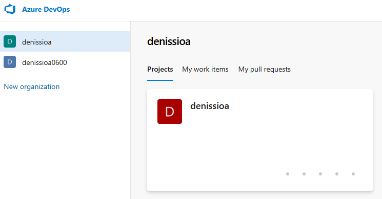
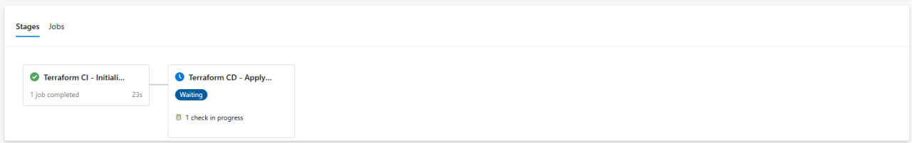
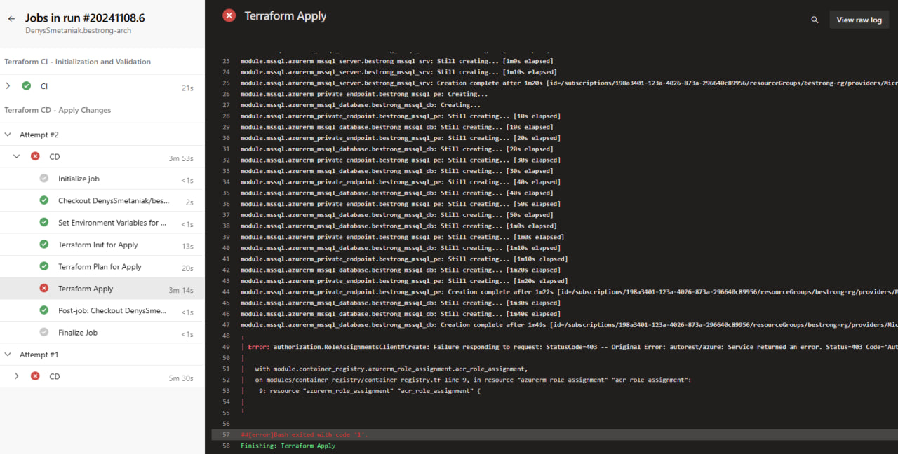
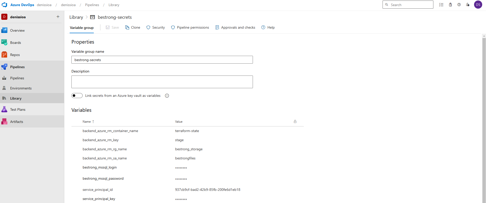

# Terraform Configuration for Azure Infrastructure

This project uses **Terraform** to set up and configure essential Azure resources for the **BeStrong** startup. The infrastructure is built with a modular approach to ensure flexibility and scalability. The main components include App Service, Key Vault, SQL Server, VNet, and more.

## Resources Created

The following resources will be created and configured:

1. **App Service Plan**
2. **App Service**
   - Integrated with **Virtual Network (VNet)**
   - Enabled **System Managed Identity** for secure authentication
3. **Application Insights**
   - Linked to the App Service for monitoring
4. **Azure Container Registry (ACR)**
   - Access granted to App Service Identity for pulling images
5. **Azure Key Vault**
   - Access permissions for App Service Identity
   - Integration with **VNet** for secure access
6. **Virtual Network (VNet)**
7. **MS SQL Server Database**
   - Configured with a **Private Endpoint** to restrict access
8. **Storage Account**
   - Private Endpoint setup with VNet
   - File Share mounted to App Service for persistent storage
9. **Storage Account for Terraform State**
   - Used to store the Terraform state file securely

## CI/CD Pipeline Configuration

To automate the deployment and maintenance of the infrastructure, a CI/CD pipeline is configured in **Azure DevOps**.

### Pipeline Structure

The CI/CD pipeline follows the **Trunk-Based Development** flow and is triggered on pull requests and commits to the `master` branch. The pipeline includes the following stages:

- **Continuous Integration (CI)**  
  This stage runs on each pull request and commit to `master` and performs validation steps:
  - **Terraform Init** - Initializes the Terraform backend configuration using Azure Storage.
  - **Terraform Validate** - Ensures the configuration files are syntactically correct.
  - **Terraform Plan** - Generates an execution plan to preview changes without applying them.

- **Continuous Deployment (CD)**  
  This stage is triggered after changes are merged into `master`. It includes a manual approval step before deploying:
  - **Manual Approval** - Configured in **Azure DevOps Environments** to require approval before executing `Terraform Apply`.
  - **Terraform Init** - Reinitializes Terraform to ensure backend and provider configurations are loaded.
  - **Terraform Plan** - Final preview of planned changes.
  - **Terraform Apply** - Applies the configuration to deploy the infrastructure.

### Security and Variable Management

All sensitive information is securely stored in Azure DevOps **Variable Groups**, which are linked to the pipeline:
- **Azure Service Principal**: Used by Terraform to authenticate and manage Azure resources.
- **SQL Server Credentials**: Stored securely to avoid exposure.

### Approval Process

The **CD stage** includes a manual approval step configured in **Azure DevOps Environments** under **Approvals and Checks**, ensuring that deployments require explicit consent before proceeding.

### Running the Pipeline

1. **Pull Requests**  
   When a pull request is created, the CI stage runs automatically, validating the code and providing a Terraform plan.

2. **Merging to `master`**  
   Upon merging, the CD stage is triggered, requiring manual approval to execute `Terraform Apply` for deploying changes.

### Requirements

1. **Azure DevOps Organization** with an Azure agent.
2. **Service Connections**  
   - **GitHub Service Connection**: Provides access to the GitHub repository.
   - **Azure Service Principal**: Allows Terraform to manage resources within Azure on behalf of the CI/CD pipeline.

### Azure DevOps Project for CI/CD

### Pipeline stage

### Manual approve

### Finished CD stage

### Group for secrets

